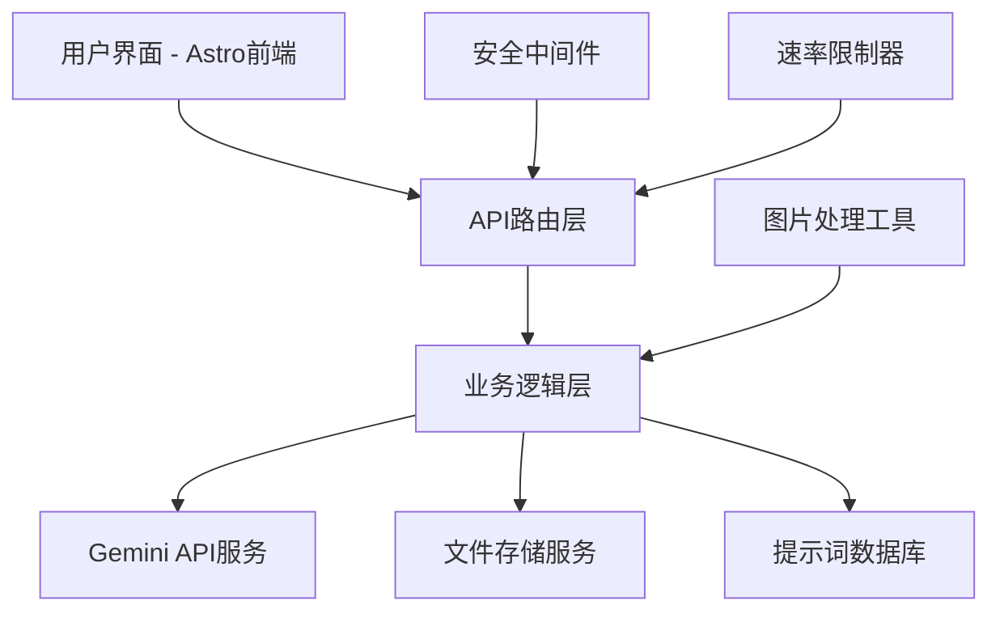

# AI图片编辑工具站设计文档

## 概述

本设计文档描述了如何在现有的Astro网站基础上集成AI图片编辑功能。系统将使用Google Gemini API提供图片生成、编辑和融合能力，采用现代Web技术栈确保良好的用户体验和系统安全性。

## 架构设计

### 整体架构



### 技术栈选择

- **前端框架**: Astro + TypeScript
- **样式系统**: Tailwind CSS (已集成)
- **API层**: Astro API Routes
- **AI服务**: Google Gemini API
- **文件存储**: 本地存储 + 临时文件管理
- **数据存储**: JSON文件存储 (提示词库)
- **图片处理**: Sharp (已集成)
- **安全**: 环境变量 + 请求验证

## 组件和接口设计

### 前端组件架构

```
src/
├── components/
│   ├── ai-editor/
│   │   ├── ImageGenerator.astro      # 图片生成组件
│   │   ├── PromptOptimizer.astro     # 提示词优化组件
│   │   ├── ImageFusion.astro         # 图片融合组件
│   │   ├── PromptLibrary.astro       # 提示词库组件
│   │   └── ui/
│   │       ├── FileUploader.astro    # 文件上传组件
│   │       ├── LoadingSpinner.astro  # 加载指示器
│   │       ├── ImagePreview.astro    # 图片预览组件
│   │       └── PromptCard.astro      # 提示词卡片
│   └── layout/
│       └── AIEditorLayout.astro      # AI编辑器专用布局
├── pages/
│   ├── ai-editor/
│   │   ├── index.astro               # AI编辑器主页
│   │   ├── generate.astro            # 图片生成页面
│   │   ├── optimize.astro            # 提示词优化页面
│   │   ├── fusion.astro              # 图片融合页面
│   │   └── prompts.astro             # 提示词库页面
│   └── api/
│       ├── ai/
│       │   ├── generate-image.ts     # 图片生成API
│       │   ├── optimize-prompt.ts    # 提示词优化API
│       │   ├── fusion-image.ts       # 图片融合API
│       │   └── prompts/
│       │       ├── index.ts          # 获取提示词列表
│       │       ├── create.ts         # 创建提示词
│       │       └── [id].ts           # 提示词CRUD操作
│       └── upload/
│           └── image.ts              # 图片上传处理
├── utils/
│   ├── gemini-client.ts              # Gemini API客户端
│   ├── image-processor.ts            # 图片处理工具
│   ├── security.ts                   # 安全工具函数
│   └── rate-limiter.ts               # 速率限制器
└── types/
    └── ai-editor.ts                  # TypeScript类型定义
```

### API接口设计

#### 1. 图片生成接口
```typescript
// POST /api/ai/generate-image
interface GenerateImageRequest {
  image: File;
  prompt: string;
  style?: string;
  quality?: 'standard' | 'high';
}

interface GenerateImageResponse {
  success: boolean;
  imageUrl?: string;
  error?: string;
  requestId: string;
}
```

#### 2. 提示词优化接口
```typescript
// POST /api/ai/optimize-prompt
interface OptimizePromptRequest {
  originalPrompt: string;
  style?: string;
  language?: 'zh' | 'en';
}

interface OptimizePromptResponse {
  success: boolean;
  optimizedPrompt?: string;
  suggestions?: string[];
  error?: string;
}
```

#### 3. 图片融合接口
```typescript
// POST /api/ai/fusion-image
interface FusionImageRequest {
  image1: File;
  image2: File;
  fusionRatio?: number; // 0-1之间
  style?: string;
}

interface FusionImageResponse {
  success: boolean;
  fusedImageUrl?: string;
  error?: string;
  requestId: string;
}
```

#### 4. 提示词管理接口
```typescript
// GET /api/ai/prompts
interface GetPromptsResponse {
  prompts: PromptItem[];
  categories: string[];
  total: number;
}

// POST /api/ai/prompts/create
interface CreatePromptRequest {
  title: string;
  content: string;
  category: string;
  tags: string[];
  description?: string;
}
```

## 数据模型

### 提示词数据模型
```typescript
interface PromptItem {
  id: string;
  title: string;
  content: string;
  category: string;
  tags: string[];
  description?: string;
  createdAt: Date;
  updatedAt: Date;
  usageCount: number;
  rating?: number;
}

interface PromptCategory {
  id: string;
  name: string;
  description: string;
  icon?: string;
}
```

### 请求记录模型
```typescript
interface RequestLog {
  id: string;
  userId?: string;
  sessionId: string;
  endpoint: string;
  timestamp: Date;
  success: boolean;
  error?: string;
  processingTime: number;
}
```

### 用户会话模型
```typescript
interface UserSession {
  sessionId: string;
  requestCount: number;
  lastRequestTime: Date;
  isBlocked: boolean;
  blockUntil?: Date;
}
```

## 错误处理策略

### 错误分类和处理

1. **API错误处理**
   - Gemini API限额超出：显示友好提示，建议稍后重试
   - 网络连接错误：自动重试机制（最多3次）
   - 图片格式错误：客户端验证 + 服务端二次验证
   - 文件大小超限：前端预检查 + 后端强制限制

2. **用户输入验证**
   - 提示词长度限制：1-2000字符
   - 图片文件验证：格式、大小、内容安全检查
   - 请求频率控制：每用户每分钟最多10次请求

3. **系统错误处理**
   - 文件存储失败：清理临时文件，返回错误信息
   - 内存不足：限制并发处理数量
   - 服务不可用：显示维护页面

### 错误响应格式
```typescript
interface ErrorResponse {
  success: false;
  error: {
    code: string;
    message: string;
    details?: any;
  };
  requestId: string;
  timestamp: Date;
}
```

## 测试策略

### 单元测试
- API路由功能测试
- 图片处理工具测试
- 安全验证函数测试
- 速率限制器测试

### 集成测试
- Gemini API集成测试
- 文件上传和处理流程测试
- 提示词CRUD操作测试

### 端到端测试
- 完整的图片生成流程测试
- 用户界面交互测试
- 错误场景处理测试

### 性能测试
- 并发请求处理能力测试
- 大文件上传性能测试
- API响应时间测试

## 安全设计

### API密钥管理
```typescript
// 环境变量配置
interface EnvironmentConfig {
  GEMINI_API_KEY: string;
  GEMINI_API_ENDPOINT: string;
  MAX_FILE_SIZE: number;
  RATE_LIMIT_WINDOW: number;
  RATE_LIMIT_MAX_REQUESTS: number;
}
```

### 请求验证中间件
```typescript
interface SecurityMiddleware {
  validateFileType(file: File): boolean;
  sanitizePrompt(prompt: string): string;
  checkRateLimit(sessionId: string): boolean;
  validateImageContent(buffer: Buffer): Promise<boolean>;
}
```

### 数据保护措施
1. **输入验证**: 严格的文件类型和大小检查
2. **内容过滤**: 敏感内容检测和过滤
3. **临时文件管理**: 自动清理机制，避免存储泄漏
4. **日志记录**: 记录关键操作，不记录敏感信息
5. **HTTPS强制**: 所有API通信使用加密传输

## 性能优化

### 前端优化
- 图片懒加载和压缩
- 组件代码分割
- 缓存策略优化
- 响应式图片处理

### 后端优化
- 图片处理异步化
- 请求队列管理
- 临时文件自动清理
- API响应缓存

### 用户体验优化
- 实时进度反馈
- 预加载关键资源
- 离线状态处理
- 移动端适配优化

## 部署和监控

### 部署配置
- 环境变量安全配置
- 文件存储目录权限设置
- 反向代理配置（如使用）
- SSL证书配置

### 监控指标
- API调用成功率
- 平均响应时间
- 错误率统计
- 用户活跃度
- 存储空间使用情况

这个设计充分考虑了你现有的Astro项目架构，确保新功能能够无缝集成，同时保持代码的可维护性和系统的安全性。