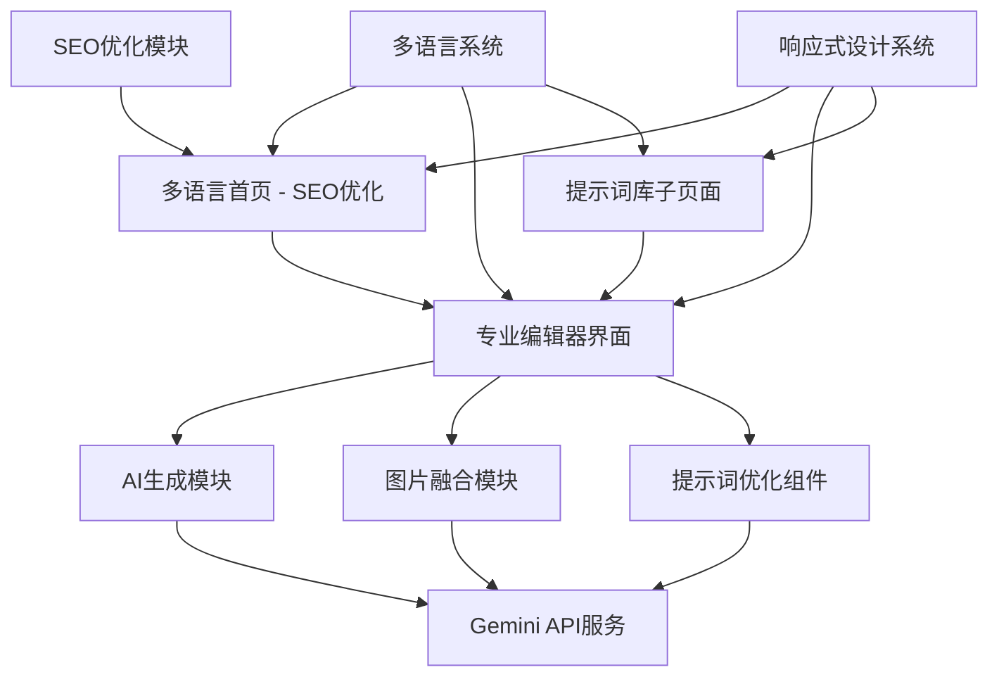

# BananaEditor AI图片编辑器设计文档

## 概述

本设计文档描述了BananaEditor的完整架构设计，这是一个专业的AI图片编辑器，重点围绕"nano banana"关键词进行SEO优化。系统将提供统一的编辑器界面，集成AI图片生成和图片融合功能，支持多语言，并提供优秀的用户体验。

## 架构设计

### 整体架构



### 技术栈选择

- **前端框架**: Astro + TypeScript (保持现有)
- **样式系统**: Tailwind CSS + 自定义BananaEditor主题
- **多语言**: Astro i18n + 动态语言切换
- **SEO优化**: astro-seo + 自定义meta标签管理
- **AI服务**: Google Gemini API (保持现有)
- **状态管理**: 原生Web Components + 局部状态
- **图片处理**: Sharp + Canvas API
- **文件存储**: 临时存储 + 自动清理

## 页面架构设计

### 1. 首页重新设计 (/)

**目标**: SEO优化，围绕"nano banana"关键词，展示BananaEditor功能

```
src/pages/index.astro (重新设计)
├── SEO优化的Hero区域
│   ├── "nano banana" 关键词突出
│   ├── BananaEditor品牌展示
│   └── 多语言支持
├── 功能演示区域
│   ├── AI生成演示动画
│   ├── 图片融合效果展示
│   └── 交互式预览
├── 特色功能介绍
├── 用户评价和案例
└── CTA区域 (进入编辑器)
```

### 2. 专业编辑器页面 (/editor)

**目标**: 统一的专业编辑器界面，集成所有AI功能

```
src/pages/editor/index.astro
├── 编辑器布局组件
│   ├── 顶部工具栏
│   │   ├── 功能切换 (生成/融合)
│   │   ├── 语言切换
│   │   └── 导出选项
│   ├── 左侧面板
│   │   ├── 功能选择器
│   │   ├── 参数控制
│   │   └── 历史记录
│   ├── 中央画布区域
│   │   ├── 图片预览
│   │   ├── 拖拽上传
│   │   └── 结果展示
│   └── 右侧属性面板
│       ├── 提示词输入
│       ├── 优化按钮
│       └── 设置选项
```

### 3. 提示词库页面 (/prompts)

**目标**: 独立的提示词管理和浏览页面

```
src/pages/prompts/index.astro
├── 搜索和筛选区域
├── 分类导航
├── 提示词网格展示
├── 详情模态框
└── 编辑器集成按钮
```

## 组件架构设计

### 核心组件结构

```
src/components/banana-editor/
├── layout/
│   ├── EditorLayout.astro          # 编辑器主布局
│   ├── EditorToolbar.astro         # 顶部工具栏
│   ├── EditorSidebar.astro         # 左侧面板
│   ├── EditorCanvas.astro          # 中央画布
│   └── EditorProperties.astro      # 右侧属性面板
├── ai-modules/
│   ├── ImageGenerator.astro        # AI图片生成模块
│   ├── ImageFusion.astro           # 图片融合模块
│   └── PromptOptimizer.astro       # 提示词优化组件
├── ui/
│   ├── FileUploader.astro          # 文件上传组件
│   ├── ImagePreview.astro          # 图片预览组件
│   ├── ProgressIndicator.astro     # 进度指示器
│   ├── LanguageSwitcher.astro      # 语言切换器
│   └── BananaButton.astro          # 品牌按钮组件
├── prompts/
│   ├── PromptLibrary.astro         # 提示词库组件
│   ├── PromptCard.astro            # 提示词卡片
│   ├── PromptSearch.astro          # 搜索组件
│   └── PromptCategories.astro      # 分类组件
└── seo/
    ├── SEOHead.astro               # SEO头部组件
    ├── StructuredData.astro        # 结构化数据
    └── SocialMeta.astro            # 社交媒体标签
```

## 多语言系统设计

### 语言配置结构

```typescript
// src/i18n/config.ts
interface LanguageConfig {
  code: string;
  name: string;
  flag: string;
  rtl: boolean;
}

const languages: LanguageConfig[] = [
  { code: 'en', name: 'English', flag: '🇺🇸', rtl: false },
  { code: 'zh', name: '中文', flag: '🇨🇳', rtl: false },
  { code: 'es', name: 'Español', flag: '🇪🇸', rtl: false },
  { code: 'fr', name: 'Français', flag: '🇫🇷', rtl: false }
];
```

### 翻译文件结构

```
src/i18n/
├── en/
│   ├── common.json              # 通用翻译
│   ├── editor.json              # 编辑器界面
│   ├── prompts.json             # 提示词相关
│   └── seo.json                 # SEO相关内容
├── zh/
│   ├── common.json
│   ├── editor.json
│   ├── prompts.json
│   └── seo.json
└── utils/
    ├── translator.ts            # 翻译工具函数
    └── seo-generator.ts         # SEO内容生成器
```

## SEO优化设计

### 关键词策略

**主关键词**: "nano banana"
**辅助关键词**: "nano banana ai", "banana ai"
**长尾关键词**: "nano banana image editor", "banana ai photo generator"

### SEO组件设计

```typescript
// src/components/seo/SEOHead.astro
interface SEOProps {
  title: string;
  description: string;
  keywords: string[];
  language: string;
  canonical?: string;
  ogImage?: string;
}

// 针对不同页面的SEO配置
const seoConfigs = {
  home: {
    en: {
      title: "Nano Banana - Professional AI Image Editor | BananaEditor",
      description: "Create stunning images with nano banana AI technology. Professional image generation and fusion tools powered by advanced AI.",
      keywords: ["nano banana", "nano banana ai", "banana ai", "ai image editor"]
    }
  },
  editor: {
    en: {
      title: "AI Image Editor - Nano Banana Professional Tools",
      description: "Professional nano banana ai image editing suite with generation and fusion capabilities."
    }
  }
};
```

### 结构化数据设计

```json
{
  "@context": "https://schema.org",
  "@type": "SoftwareApplication",
  "name": "BananaEditor",
  "description": "Professional AI image editor powered by nano banana technology",
  "applicationCategory": "DesignApplication",
  "operatingSystem": "Web Browser",
  "offers": {
    "@type": "Offer",
    "price": "0",
    "priceCurrency": "USD"
  },
  "keywords": "nano banana, nano banana ai, banana ai, image editor"
}
```

## 编辑器界面设计

### 布局系统

```css
/* BananaEditor主题色彩系统 */
:root {
  --banana-primary: #FFD700;      /* 香蕉黄主色 */
  --banana-secondary: #FFA500;    /* 橙黄辅助色 */
  --banana-accent: #FF6B35;       /* 橙红强调色 */
  --banana-dark: #2D1810;         /* 深棕色 */
  --banana-light: #FFF8DC;        /* 浅黄背景 */
  --banana-gradient: linear-gradient(135deg, #FFD700 0%, #FFA500 100%);
}

/* 编辑器布局 */
.editor-layout {
  display: grid;
  grid-template-areas: 
    "toolbar toolbar toolbar"
    "sidebar canvas properties"
    "sidebar canvas properties";
  grid-template-columns: 280px 1fr 320px;
  grid-template-rows: 60px 1fr;
  height: 100vh;
}
```

### 响应式设计

```css
/* 移动端适配 */
@media (max-width: 768px) {
  .editor-layout {
    grid-template-areas: 
      "toolbar"
      "canvas"
      "controls";
    grid-template-columns: 1fr;
    grid-template-rows: 60px 1fr auto;
  }
  
  .editor-sidebar,
  .editor-properties {
    position: fixed;
    bottom: 0;
    left: 0;
    right: 0;
    transform: translateY(100%);
    transition: transform 0.3s ease;
  }
  
  .editor-sidebar.active,
  .editor-properties.active {
    transform: translateY(0);
  }
}
```

## API设计

### 统一的API接口

```typescript
// src/types/banana-editor.ts
interface EditorAPI {
  // AI图片生成
  generateImage(params: GenerateParams): Promise<GenerateResult>;
  
  // 图片融合
  fuseImages(params: FusionParams): Promise<FusionResult>;
  
  // 提示词优化
  optimizePrompt(params: OptimizeParams): Promise<OptimizeResult>;
  
  // 提示词库管理
  getPrompts(filters: PromptFilters): Promise<PromptItem[]>;
  savePrompt(prompt: PromptItem): Promise<void>;
}

interface GenerateParams {
  image?: File;
  prompt: string;
  style?: string;
  quality?: 'standard' | 'high';
  language?: string;
}

interface FusionParams {
  image1: File;
  image2: File;
  ratio?: number;
  style?: string;
  blendMode?: 'normal' | 'multiply' | 'overlay';
}
```

### API路由设计

```
src/pages/api/banana-editor/
├── generate.ts                  # POST /api/banana-editor/generate
├── fusion.ts                    # POST /api/banana-editor/fusion
├── optimize-prompt.ts           # POST /api/banana-editor/optimize-prompt
├── prompts/
│   ├── index.ts                 # GET /api/banana-editor/prompts
│   ├── create.ts                # POST /api/banana-editor/prompts/create
│   └── [id].ts                  # GET/PUT/DELETE /api/banana-editor/prompts/[id]
└── upload.ts                    # POST /api/banana-editor/upload
```

## 用户体验设计

### 工作流程设计

1. **首页访问流程**
   - 用户访问首页 → SEO优化内容展示 → 功能演示 → 引导进入编辑器

2. **编辑器使用流程**
   - 选择功能 → 上传素材 → 配置参数 → AI处理 → 预览结果 → 导出分享

3. **提示词优化流程**
   - 输入基础提示词 → 点击优化按钮 → 查看优化建议 → 选择应用 → 继续编辑

### 交互设计原则

- **即时反馈**: 所有操作都有即时的视觉反馈
- **渐进式披露**: 复杂功能分步骤展示
- **容错设计**: 提供撤销和重做功能
- **快捷操作**: 支持键盘快捷键和手势操作

## 性能优化设计

### 前端优化策略

```typescript
// 图片懒加载和优化
const imageOptimization = {
  // 自动压缩上传图片
  compressImage: (file: File, quality: number = 0.8) => Promise<File>,
  
  // 渐进式加载
  lazyLoadImages: () => void,
  
  // WebP格式支持
  convertToWebP: (file: File) => Promise<File>,
  
  // 缩略图生成
  generateThumbnail: (file: File, size: number) => Promise<string>
};
```

### 缓存策略

```typescript
// 多层缓存设计
interface CacheStrategy {
  // 浏览器缓存
  browserCache: {
    staticAssets: '1y',
    apiResponses: '5m',
    userPreferences: 'persistent'
  };
  
  // 服务端缓存
  serverCache: {
    promptLibrary: '1h',
    optimizedPrompts: '30m',
    generatedImages: '24h'
  };
}
```

## 安全设计

### 输入验证和过滤

```typescript
// 安全验证中间件
interface SecurityMiddleware {
  // 文件类型验证
  validateFileType: (file: File) => boolean;
  
  // 内容安全检查
  contentSafetyCheck: (prompt: string) => Promise<boolean>;
  
  // 速率限制
  rateLimiting: {
    perUser: '10/min',
    perIP: '50/min',
    global: '1000/min'
  };
  
  // CSRF保护
  csrfProtection: boolean;
}
```

## 部署和监控设计

### 环境配置

```typescript
// 环境变量配置
interface EnvironmentConfig {
  // API配置
  GEMINI_API_KEY: string;
  GEMINI_API_ENDPOINT: string;
  
  // 功能开关
  ENABLE_IMAGE_GENERATION: boolean;
  ENABLE_IMAGE_FUSION: boolean;
  ENABLE_PROMPT_OPTIMIZATION: boolean;
  
  // 限制配置
  MAX_FILE_SIZE: number;
  MAX_CONCURRENT_REQUESTS: number;
  
  // SEO配置
  SITE_URL: string;
  DEFAULT_LANGUAGE: string;
  SUPPORTED_LANGUAGES: string[];
}
```

### 监控指标

```typescript
// 关键性能指标
interface MonitoringMetrics {
  // 用户行为
  userEngagement: {
    dailyActiveUsers: number;
    sessionDuration: number;
    featureUsage: Record<string, number>;
  };
  
  // 性能指标
  performance: {
    pageLoadTime: number;
    apiResponseTime: number;
    imageProcessingTime: number;
  };
  
  // SEO指标
  seo: {
    organicTraffic: number;
    keywordRankings: Record<string, number>;
    clickThroughRate: number;
  };
}
```

## 测试策略

### 测试覆盖范围

1. **单元测试**
   - 组件功能测试
   - API接口测试
   - 工具函数测试

2. **集成测试**
   - AI功能集成测试
   - 多语言系统测试
   - 文件上传流程测试

3. **端到端测试**
   - 完整用户流程测试
   - 跨浏览器兼容性测试
   - 移动端响应式测试

4. **SEO测试**
   - 关键词排名测试
   - 页面速度测试
   - 结构化数据验证

这个设计充分考虑了你的需求，围绕"nano banana"关键词进行SEO优化，提供专业的编辑器界面，集成AI功能，支持多语言，并确保良好的用户体验和性能。